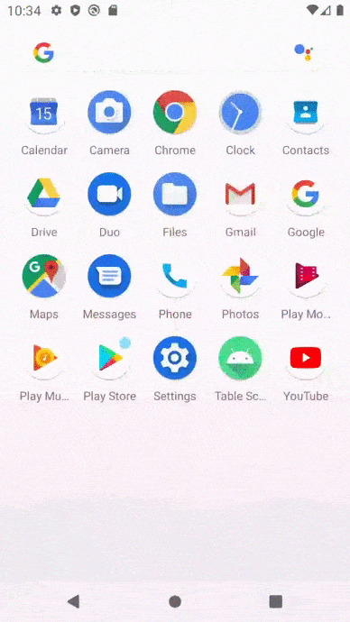

# TableScanner
Simple Android classes (with example activity) to find table cells on bitmap. Should/must be improved of course.

How to use
--------
```kotlin
// Create scanner with appropriate tolerance:
val scanner = Scanner(50)

// Find cells in bitmap scanning from some point in chosen direction:
val cells: List<Cell> = scanner.scan(
                    bitmap,
                    Point((0.5 * bitmap.width).toInt(), (0.5 * bitmap.height).toInt()),
                    Scanner.Direction.TOP_BOTTOM,
                    drawCells = true,
                    drawVertices = true
                )
```

Result
--------


TODO
--------
Consider possible table rotation.

Find tables without setting a start point.